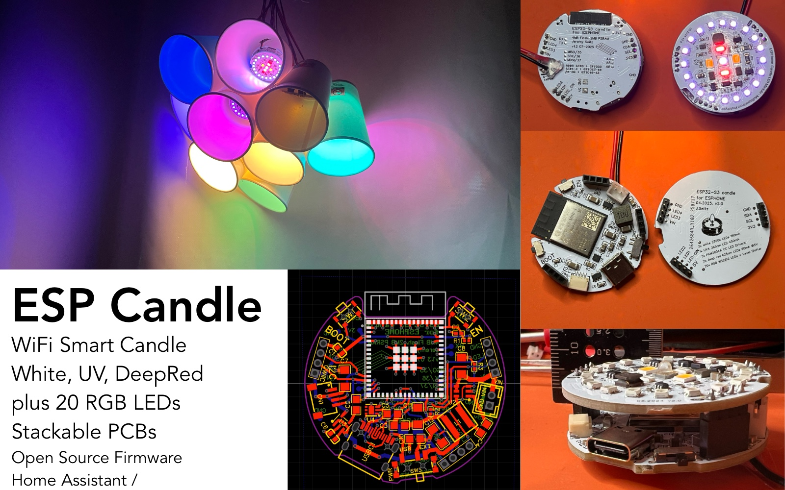
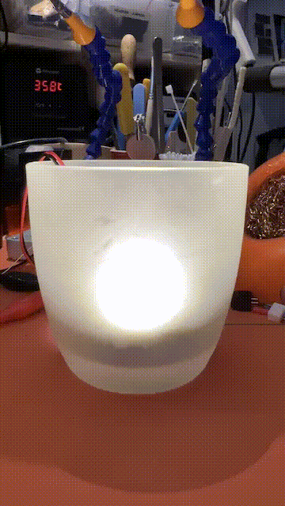
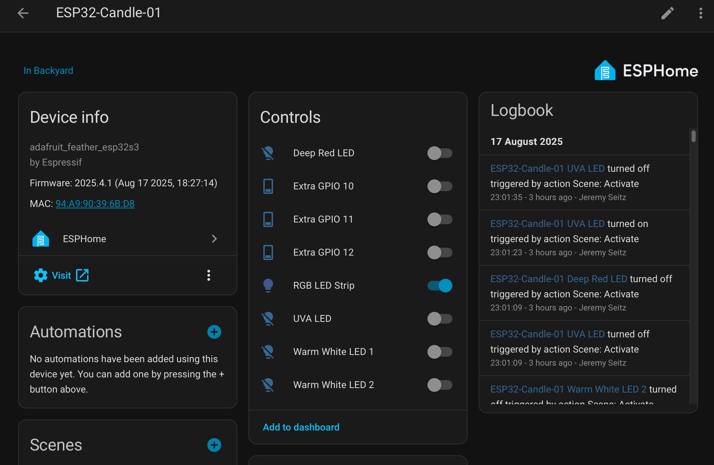

# ESP32 Candle Firmware





A tea candle-sized LED-powered smart light. The PCB stack is 38.6mm in diameter and 2cm tall, so that it can be placed in a standard candle holder or lantern (which are normally >40mm round spaces). It features RGB, a very bright warm white LED, and two UV LEDs. It can be powered by USB-C or via 6-20v DC external input.

This project supports both standalone Arduino firmware and Home Assistant integration via ESPHome.

> **HOW TO ORDER**: We will have a limited run of pre-assembled candles ready for shipment in **Jan 2026**, you can order here: https://www.soliddifference.com/store - shipped with love from Switzerland

## Hardware Specifications

### Core Features

- **ESP32-S3 Mini** with PSRAM
- **Power Input**: 6-20v DC or USB-C
- **Form Factor**: 38.6mm diameter × 20mm tall (tea candle size)
- **Mounting**: Fits standard candle holders and lanterns (>40mm spaces)

### LED Configuration

- **2x Bright White LEDs**: 2700K warm white, 0.5W at 150mA, 20,000 mcd
- **2x Deep Red LEDs**: 620nm wavelength, 730 mcd  
- **1x UV LED**: 365nm wavelength, 500mA at 4V
- **20x RGB WS2812 LEDs**: 2020 package addressable LEDs

### Hardware v1.4

Both white LED channels now use a BCR421 linear constant-current regulator driver with 67-21S/KK7C-H276034Z15 LEDs (2700K, 150mA max, Vf around 3.2V). The **UV channel** uses a PAM2804 driver, 4.7uH inductor and 0.33 ohm Rsense at 300mA. The red LEDs are controlled with a N-channel mosfet (AO3402)PWM circuit, 35ma each. With all channels active, power consumption can reach 1.5w.


### Connectivity & Power

- **USB-C Interface**: Power and firmware upload
- **JST SH (2.0mm)**: External power input with cable routing hole
- **Power Source Switch**: Toggle between USB-C and external power
- **I2C Connectors**:
  - JST SH 1.0mm QWICK connector
  - PCB headers
- **Extra Pads**: I2C and 5V power injection points

## PCB Pinout & Connectivity

### GPIO Pinout Summary

| GPIO | Function | Description |
|------|----------|-------------|
| 0 | Button Input | Boot button / Mode switching |
| 8 | I2C SDA | I2C data line |
| 9 | I2C SCL | I2C clock line |
| 10-12 | Extra GPIO | Available as digital outputs/inputs |
| 15 | PWM LED 1 | Bright White LED (2700K, 0.5W at 150mA) |
| 16 | PWM LED 2 | Bright White LED (2700K, 0.5W at 150mA) |
| 17 | PWM LED 3 | UV LED (365nm) |
| 18 | PWM LED 4 | Deep Red LED (620nm, 730 mcd) |
| 33 | WS2812 | RGB LED strip data (20x 2020 LEDs) |

### Additional Features

- **I2C Bus** (GPIO8/9): For sensors and expansion modules
- **Internal Temperature Sensor**: Monitor ESP32 core temperature
- **Extra GPIO Pins** (GPIO10-12): Configurable digital I/O
- **WiFi Connectivity**: For Home Assistant integration, ESPNow, etc.

## Software Options

Choose between two firmware approaches based on your needs:

### Option 1: PlatformIO Demo (standalone) Firmware

A standalone firmware with built-in lighting modes and button control, build with PlatformIO. For an Arduino build (.ino) please [file an issue](https://github.com/PixelTheater/espcandle-demo/issues/new) and I'll try to help out.

#### Features

- **Candle Mode**: Realistic flickering using warm white and red LEDs
- **Color Mode**: Slowly rotating rainbow patterns on RGB strip
- **Magic Mode**: Green-to-purple transitions with UV LEDs active
- **Auto Mode**: Automatically cycles through all modes every 60 seconds

#### Controls

- **Short Press**: Cycle through modes (Candle → Color → Magic → Auto)
- **Long Press (3s)**: Power on/off
- **Serial Output**: Mode changes and status via USB (115200 baud)

#### Installation

1. Install PlatformIO (in VSCode or use the command line tools)
2. Clone this repository
3. Open the project in PlatformIO
4. Build and upload to your ESP32-S3 board:

   ```bash
   pio run --target upload
   ```

#### Configuration

The demo firmware is pre-configured for the PCB pinout. Key settings in `src/main.cpp`:
- PWM frequency: 5kHz, 8-bit resolution
- Max brightness: 30% (safety limit)
- WS2812: 25% brightness, 20 LEDs

The "boot" button will cycle through the modes. There are four modes:

- Candle: Realistic flickering using warm white and red LEDs
- Color: Slowly rotating rainbow patterns on RGB strip
- Magic: Green-to-purple transitions with UV LEDs active
- Auto: Automatically cycles through all modes over time.

The "EN" button will reset the device.

### Option 2: ESPHome Integration

Full Home Assistant integration with advanced lighting effects and remote control.



#### Features

- **Individual LED Control**: Each LED controllable separately
- **Advanced Effects**: Flicker, rainbow, color wipe, twinkle, and random patterns
- **Home Assistant Integration**: auto-discovery via the native API, OTA updates, automation, scenes
- **Web provisioning**: first-time Wi-Fi setup over USB (improv-serial) or BLE (esp32_improv), no YAML editing
- **Captive portal fallback**: if Wi-Fi is lost the candle re-opens its setup AP
- **Temperature monitoring**, WiFi signal, uptime, IP/MAC diagnostics
- **Extra GPIO Control**: 3 digital switches for expansion

#### How the firmware is structured

Three ESPHome files in this repo:

- `esphome/espcandle.base.yaml` - the shared base. All hardware, provisioning, lights, switches, sensors, and diagnostics. Every candle uses this file unchanged.
- `esphome/espcandle.example.yaml` - a ~30-line per-device template. Copy once per physical candle, set the name, flash. The only file you maintain per candle.
- `esphome/secrets-example.yaml` - template for `secrets.yaml`, holding Wi-Fi creds and per-device API keys / OTA passwords.

There are two flashing flows:

1. **Web flasher (planned, for end customers)** - a future `support.soliddifference.com` will host an ESP Web Tools page that flashes a pre-built factory firmware over USB, then uses improv-serial to set Wi-Fi. Adoption in HA negotiates a per-device API encryption key. **Not available yet.**
2. **Build from this repo (the path you use today)** - install ESPHome, set per-device secrets, flash over USB. Documented below.

#### Build and flash from this repo

This is the supported path while the web flasher doesn't exist, and the recommended path for anyone running multiple candles or contributing changes.

1. **Install the ESPHome toolchain into a project venv:**

   ```bash
   cd /path/to/espcandle-demo
   python3 -m venv .venv
   source .venv/bin/activate
   pip install -r esphome/requirements.txt
   ```

2. **Create your `secrets.yaml`:**

   ```bash
   cp esphome/secrets-example.yaml esphome/secrets.yaml
   ```

   Edit `esphome/secrets.yaml` and set:
   - `wifi_ssid` and `wifi_password` (your home Wi-Fi)
   - `fallback_ap_password` - generate with `openssl rand -hex 12`
   - For each candle, an `<name>_api_key` and `<name>_ota_password`. Generate:

     ```bash
     echo "candle_livingroom_api_key:      \"$(openssl rand -base64 32)\""
     echo "candle_livingroom_ota_password: \"$(openssl rand -hex 16)\""
     ```

   `secrets.yaml` is gitignored.

3. **Create one per-device YAML per candle:**

   ```bash
   cp esphome/espcandle.example.yaml esphome/candle-livingroom.yaml
   ```

   Edit `name`, `friendly_name`, and the two `!secret` references to match the secret names from step 2.

4. **Validate, then flash over USB-C:**

   ```bash
   esphome config esphome/candle-livingroom.yaml          # YAML check
   esphome run esphome/candle-livingroom.yaml             # compile + flash + monitor
   ```

   The first run downloads ESP-IDF (~5 minutes, cached afterwards). When it asks for a port, pick the `/dev/cu.usbmodem*` entry that appeared when you plugged the candle in.

5. **Watch it join Wi-Fi.** Logs stream over USB. Within ~10 seconds you'll see `WiFi: Connected` and the device's IP. The candle is now reachable as `<name>.local`.

6. **Adopt in Home Assistant.** Settings → Devices & Services. The candle shows up under *Discovered*. Click **Configure**, paste the API encryption key from `secrets.yaml` when prompted, done.

7. **Subsequent updates go OTA**, no USB needed:

   ```bash
   esphome run esphome/candle-livingroom.yaml
   ```

   ESPHome auto-detects the candle on the LAN and uses the OTA password from secrets.

8. **Flashing more candles:** repeat steps 3-6 with a new file name (`candle-kitchen.yaml`, etc.) and a new pair of secrets. To bulk-update after editing the base:

   ```bash
   for f in esphome/candle-*.yaml; do esphome run "$f"; done
   ```

Per-candle YAMLs other than `espcandle.example.yaml` are gitignored, so private keys never reach version control.

#### What the base config exposes

**Lights** (with `restore_mode: RESTORE_DEFAULT_OFF`, `default_transition_length: 0s` on the strip, `gamma_correct: 1.0`):
- `RGB LED Strip` - 20 WS2812s with rainbow, color-wipe, and twinkle effects
- `Warm White 1 & 2` - individual warm-white channels with flicker effects
- `UV LED` - 365nm channel, power-capped at 50%
- `Deep Red LED` - deep red accent

**Buttons:** Restart, Factory Reset, Safe Mode (HA-side recovery without USB).

**Switches:** Extra GPIO 10/11/12 with restored state.

**Boot button:** short press toggles the RGB strip, 3-second hold reboots.

**Diagnostics:** internal temperature, uptime, WiFi signal (dB and %), IP/SSID/MAC, ESPHome version, last restart time.

#### Customising hardware for variants

Pin assignments and power caps are exposed as `substitutions:` in `espcandle.base.yaml`. To override one without forking, set it in the per-device YAML before the `packages:` line:

```yaml
substitutions:
  name: esp32-candle-prototype
  friendly_name: Prototype
  led_pin: GPIO32
  white_max_power: "50%"

packages:
  espcandle: !include espcandle.base.yaml
```

**Available Effects:**
- Flicker (realistic candle simulation)
- Rainbow (smooth color transitions)
- Color Wipe (progressive color filling)
- Twinkle (sparkle effects)
- Random (random color/brightness changes)

## Hardware Setup

1. **Power Supply**:
   - **USB-C**: Connect USB-C cable for 5V power and programming
   - **External Power**: Use JST SH 2.0mm connector for 6-20V DC input
   - **Power Switch**: Toggle slide switch to select USB-C or external power source

2. **Form Factor**:
   - Diameter: 38.6mm (fits in standard >40mm candle holders)
   - Height: 20mm (2cm tall stack)
   - Designed to fit in tea light holders and lanterns

3. **I2C Expansion** (optional):
   - **QWICK Connector**: JST SH 1.0mm for easy sensor connections
   - **PCB Headers**: Traditional pin headers for breadboard connections
   - **Extra Pads**: I2C and 5V power injection points for custom wiring

4. **Programming**: Connect via USB-C for firmware upload and serial monitoring

## Troubleshooting

### Arduino Demo Issues

- **LEDs not working**: Check ESP-IDF version compatibility (requires 2.x LEDC syntax)
- **Button not responding**: Verify GPIO0 is pulled high and button grounds the pin
- **Serial output**: Connect to USB and monitor at 115200 baud

### ESPHome Issues

- **Device not discovered**: confirm the candle joined Wi-Fi - it should show as `esp32-candle-XXXXXX.local` on the network. If it didn't, it will fall back to its setup AP after ~90 seconds; re-run improv-serial from the web flasher or join the AP and use the captive portal.
- **API connection failed**: by default Home Assistant generates and stores a unique encryption key during adoption. If the device was reflashed, HA's stored key no longer matches and adoption fails - delete the device in HA and let it re-discover so a new key is negotiated. If you pinned a key in your per-device YAML, that value must match what HA has on file.
- **OTA update failed**: confirm the device is on Wi-Fi. If you set an OTA password, it must match the one used at flash time. Press the candle's **Safe Mode** button in HA, then retry.
- **Want to start over**: press **Factory Reset** in HA (or hold the boot button for 10s) - the candle wipes Wi-Fi creds and re-enters provisioning mode.

## Development Notes

- **ESP-IDF Compatibility**: Code is compatible with ESP-IDF 2.x (uses `ledcSetup` + `ledcAttachPin`)
- **Power Management**: PWM channels have safety limits to prevent LED overcurrent
- **Timing**: FastLED updates run at ~50Hz for smooth animations

## License

This project is open source. Feel free to modify and adapt for your specific needs.

## Contributing

Contributions welcome! Please submit pull requests or open issues for:
- New lighting effects
- Hardware variants
- Documentation improvements
- Bug fixes
