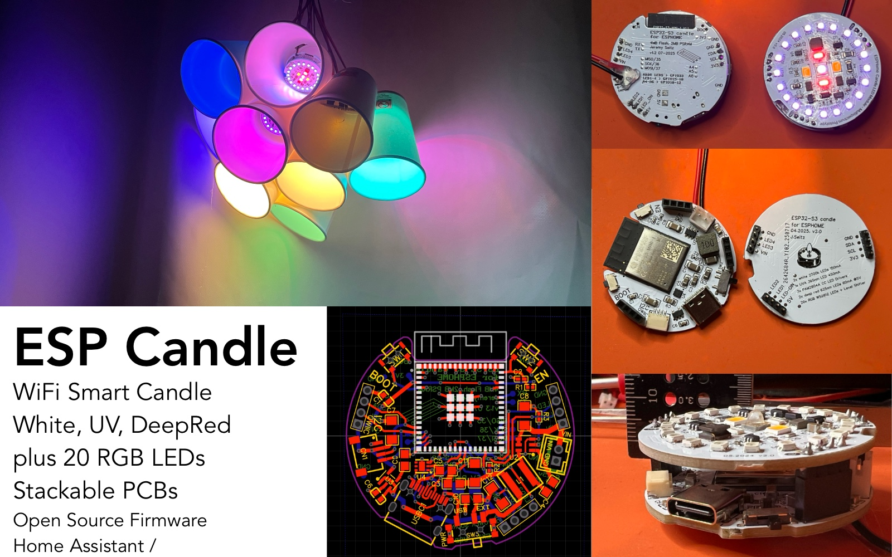

# ESP32 Candle Firmware




A tea candle-sized LED-powered smart light. The PCB stack is 38.6mm in diameter and 2cm tall, so that it can be placed in a standard candle holder or lantern (which are normally >40mm round spaces). It features RGB, a very bright warm white LED, and two UV LEDs. It can be powered by USB-C or via 6-20v DC external input.

This project supports both standalone Arduino firmware and Home Assistant integration via ESPHome.

## Hardware Specifications

### Core Features

- **ESP32-S3 Mini** with PSRAM
- **Power Input**: 6-20v DC or USB-C
- **Form Factor**: 38.6mm diameter × 20mm tall (tea candle size)
- **Mounting**: Fits standard candle holders and lanterns (>40mm spaces)

### LED Configuration

- **2x Bright White LEDs**: 2700K warm white, 0.5W at 150mA, 20,000 mcd
- **2x Deep Red LEDs**: 620nm wavelength, 730 mcd  
- **1x UV LED**: 365nm wavelength, 500mA at 4V
- **20x RGB WS2812 LEDs**: 2020 package addressable LEDs


### Connectivity & Power

- **USB-C Interface**: Power and firmware upload
- **JST SH (2.0mm)**: External power input with cable routing hole
- **Power Source Switch**: Toggle between USB-C and external power
- **I2C Connectors**:
  - JST SH 1.0mm QWICK connector
  - PCB headers
- **Extra Pads**: I2C and 5V power injection points

## PCB Pinout & Features

### LED Outputs

- **4x PWM LED Channels** (GPIO15-18): Individual control for specialized LEDs
  - 2x Bright White LEDs (GPIO15, GPIO16): 2700K warm white, 0.5W at 150mA, 20,000 mcd
  - 2x Deep Red LEDs (GPIO17, GPIO18): 620nm wavelength, 730 mcd
- **1x UV LED** (GPIO17): 365nm wavelength, 500mA at 4V  
- **WS2812 RGB Strip** (GPIO33): 20 addressable RGB LEDs (2020 package) for color effects

### GPIO Pinout Summary

| GPIO | Function | Description |
|------|----------|-------------|
| 0 | Button Input | Boot button / Mode switching |
| 8 | I2C SDA | I2C data line |
| 9 | I2C SCL | I2C clock line |
| 10-12 | Extra GPIO | Available as digital outputs/inputs |
| 15 | PWM LED 1 | Bright White LED (2700K, 0.5W at 150mA) |
| 16 | PWM LED 2 | Bright White LED (2700K, 0.5W at 150mA) |
| 17 | PWM LED 3 | Deep Red LED (620nm, 730 mcd) OR UV LED (365nm) |
| 18 | PWM LED 4 | Deep Red LED (620nm, 730 mcd) |
| 33 | WS2812 | RGB LED strip data (20x 2020 LEDs) |

### Additional Features

- **I2C Bus** (GPIO8/9): For sensors and expansion modules
- **Internal Temperature Sensor**: Monitor ESP32 core temperature
- **Extra GPIO Pins** (GPIO10-12): Configurable digital I/O
- **WiFi Connectivity**: For Home Assistant integration

## Software Options

Choose between two firmware approaches based on your needs:

### Option 1: Arduino Demo Firmware

A standalone firmware with built-in lighting modes and button control.

#### Features

- **Candle Mode**: Realistic flickering using warm white and red LEDs
- **Color Mode**: Slowly rotating rainbow patterns on RGB strip
- **Magic Mode**: Green-to-purple transitions with UV LEDs active
- **Auto Mode**: Automatically cycles through all modes every 60 seconds

#### Controls

- **Short Press**: Cycle through modes (Candle → Color → Magic → Auto)
- **Long Press (3s)**: Power on/off
- **Serial Output**: Mode changes and status via USB (115200 baud)

#### Installation

1. Install PlatformIO in your IDE
2. Clone this repository
3. Open the project in PlatformIO
4. Build and upload to your ESP32-S3 board:

   ```bash
   pio run --target upload
   ```

#### Configuration

The demo firmware is pre-configured for the PCB pinout. Key settings in `src/main.cpp`:
- PWM frequency: 5kHz, 8-bit resolution
- Max brightness: 30% (safety limit)
- WS2812: 25% brightness, 20 LEDs

### Option 2: ESPHome Integration

Full Home Assistant integration with advanced lighting effects and remote control.


#### Features

- **Individual LED Control**: Each LED controllable separately
- **Advanced Effects**: Flicker, rainbow, color wipe, twinkle, and random patterns
- **Home Assistant Integration**: Full automation and scene support
- **OTA Updates**: Wireless firmware updates
- **Temperature Monitoring**: ESP32 internal temperature sensor
- **Extra GPIO Control**: Digital switches for expansion

#### Quick Installation (Single Device)

1. **Install ESPHome**: Follow the [ESPHome installation guide](https://esphome.io/guides/installing_esphome.html)

2. **Create secrets file**:

   ```yaml
   # esphome/secrets.yaml
   wifi_ssid: "Your_WiFi_Network"
   wifi_password: "your_wifi_password"
   ```

3. **Flash initial firmware**:

   ```bash
   esphome run esphome/espcandle_01.yaml
   ```

4. **Add to Home Assistant**:
   - Go to Settings → Devices & Services
   - ESPHome integration should auto-discover the device
   - Click "Configure" and add the device

#### Bulk Installation (Multiple Candles)

For installing multiple candle devices efficiently:

1. **Generate new device configs**:

   ```bash
   # In ESPHome dashboard, click "New Device"
   # Follow the wizard but CANCEL at the installation step
   # This generates a new YAML with unique API/OTA keys
   ```

2. **Create device-specific YAML**:
   - Copy the generated API encryption key and OTA password
   - Create a new file (e.g., `espcandle_02.yaml`) based on `espcandle_01.yaml`
   - Update the device name and keys:

   ```yaml
   esphome:
     name: esp32-candle-02
     friendly_name: ESP32-Candle-02
   
   api:
     encryption:
       key: "NEW_GENERATED_KEY_HERE"
   
   ota:
     - platform: esphome
       password: "NEW_GENERATED_PASSWORD_HERE"
   ```

3. **Flash the firmware**:

   ```bash
   esphome run esphome/espcandle_02.yaml
   ```

4. **Add to Home Assistant**:
   - Device will be auto-discovered
   - When prompted about existing configuration, select **"Yes"** to overwrite
   - This allows quick addition without manual reconfiguration

#### ESPHome Configuration Details

The ESPHome configuration provides:

**Light Entities:**
- `RGB LED Strip`: 20 addressable LEDs with rainbow, color wipe, and twinkle effects
- `Warm White LED 1 & 2`: Individual warm white channels with flicker effects
- `UVA LED`: UV light with safety power limiting
- `Deep Red LED`: Deep red accent lighting

**Switch Entities:**
- `Extra GPIO 10-12`: Configurable digital outputs for expansion

**Sensor Entities:**
- `Internal Temperature`: ESP32 core temperature monitoring

**Available Effects:**
- Flicker (realistic candle simulation)
- Rainbow (smooth color transitions)
- Color Wipe (progressive color filling)
- Twinkle (sparkle effects)
- Random (random color/brightness changes)

## Hardware Setup

1. **Power Supply**:
   - **USB-C**: Connect USB-C cable for 5V power and programming
   - **External Power**: Use JST SH 2.0mm connector for 6-20V DC input
   - **Power Switch**: Toggle slide switch to select USB-C or external power source

2. **Form Factor**:
   - Diameter: 38.6mm (fits in standard >40mm candle holders)
   - Height: 20mm (2cm tall stack)
   - Designed to fit in tea light holders and lanterns

3. **I2C Expansion** (optional):
   - **QWICK Connector**: JST SH 1.0mm for easy sensor connections
   - **PCB Headers**: Traditional pin headers for breadboard connections
   - **Extra Pads**: I2C and 5V power injection points for custom wiring

4. **Programming**: Connect via USB-C for firmware upload and serial monitoring

## Troubleshooting

### Arduino Demo Issues

- **LEDs not working**: Check ESP-IDF version compatibility (requires 2.x LEDC syntax)
- **Button not responding**: Verify GPIO0 is pulled high and button grounds the pin
- **Serial output**: Connect to USB and monitor at 115200 baud

### ESPHome Issues

- **Device not discovered**: Check WiFi credentials in secrets.yaml
- **API connection failed**: Verify encryption key matches between YAML and Home Assistant
- **OTA update failed**: Ensure device is powered and network is stable

## Development Notes

- **ESP-IDF Compatibility**: Code is compatible with ESP-IDF 2.x (uses `ledcSetup` + `ledcAttachPin`)
- **Power Management**: PWM channels have safety limits to prevent LED overcurrent
- **Timing**: FastLED updates run at ~50Hz for smooth animations

## License

This project is open source. Feel free to modify and adapt for your specific needs.

## Contributing

Contributions welcome! Please submit pull requests or open issues for:
- New lighting effects
- Hardware variants
- Documentation improvements
- Bug fixes
